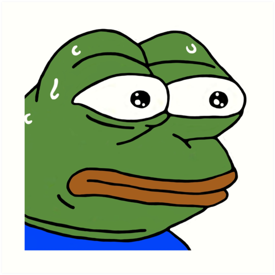

# Grayscale 

## Problem

Given a .bmp image file, turn it into a grayscale picture (use whatever method you've learned in Computer Graphics classes or pick one from here https://en.wikipedia.org/wiki/Grayscale)

## Instructions

### 24-bit True Color BMP Format

#### If you want to covner a picture to this format
	https://online-converting.com/image/convert2bmp/

#### Metadata
	In the beginning of the file there is relevant information about it
		Starting from position 2: Size of the file in bytes (int size)
		Starting from position 10: Start of the image data (int start)
		Starting from position 18: Width of the image in pixels (int cols)
		Starting from position 22: Height of the image in pixels (int rows)

The name in the brackets will be used in the explanation from now on.

#### Image data
	Starting from "start":
		"row" lines
		every line is at least "cols" pixels long
		one pixel is 3 bytes. First byte represents blue value from (0 to 255), second is green, third is red
		every line is padded so the amount on pixels is divisible by 4 (e.g. if there are 4 pixels in a line, there is no padding, if there are 5 pixels in a line there is 3 pixels padding)
		Amount of padding is the same on every line (obvously)
		Padding is ignored when displaying the image

### How to procede
	Extract the metadata
	Iterate through the image data
		read 3 bytes, transform them, replace the old bytes with the transformed ones
		skip the padding

### Note
    Try to adhere to as many OOP principles as possible

## Example

Pre-transformation:

Post-transformation:

Post-transformation with different grayscale function:

